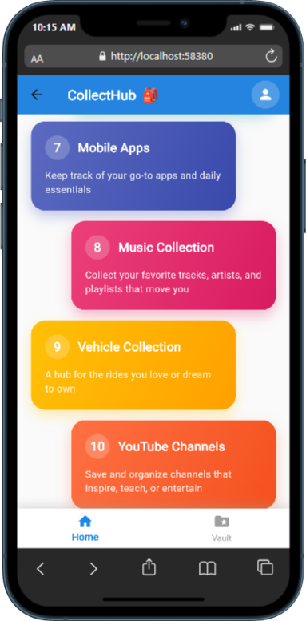

# CollectHub 🎒

## Your personal collections, all in one place — in one app.

  


---

## 📲 Download CollectHub

Get CollectHub on your device today!

[](https://www.amazon.in/dp/B0FR336WFB/ref=sr_1_1?crid=1D0SVTEMRGP9C&dib=eyJ2IjoiMSJ9.q4cm3eTFnwL8uWnjnuqlmw.DDDnR4rdzvuZXROFCbLBm_ghSHXoxK1vzWocuPfTG1o&dib_tag=se&keywords=collecthub&qid=1758115392&s=mobile-apps&sprefix=collecthub%2Cmobile-apps%2C249&sr=1-1)

**Direct Link**: [CollectHub on Amazon Appstore](https://www.amazon.in/dp/B0FR336WFB/ref=sr_1_1?crid=1D0SVTEMRGP9C&dib=eyJ2IjoiMSJ9.q4cm3eTFnwL8uWnjnuqlmw.DDDnR4rdzvuZXROFCbLBm_ghSHXoxK1vzWocuPfTG1o&dib_tag=se&keywords=collecthub&qid=1758115392&s=mobile-apps&sprefix=collecthub%2Cmobile-apps%2C249&sr=1-1)

---

## 📱 App Screenshots

### 🔐 Authentication Flow
<div align="center">
  
  
  
</div>

### ✅ Login Success & Navigation
<div align="center">
  
  
</div>

### 🏠 Main Application Screens
<div align="center">
  
  
  
  
</div>

### 🔒 Vault/Collections Management
<div align="center">
  
  
  
</div>

### 📝 Collection Item Management
<div align="center">
  
  
  
  
</div>

---

## 🚀 Tech Stack

CollectHub is built with a modern and robust tech stack:

*   **Frontend (Mobile App)**:
    *   💙 Flutter
*   **Backend (APIs)**:
    *   🟣 Fiber (Go Lang) 
    *   💚 .NET Core Web API
*   **Database**:
    *   🍃 MongoDB

---

## 🛠️ Getting Started for Developers

Follow these steps to get CollectHub up and running on your local machine for development and testing.

### Prerequisites

Before you begin, ensure you have the following installed:

*   **Flutter SDK**: [Installation Guide](https://flutter.dev/docs/get-started/install)
*   **Git**: [Installation Guide](https://git-scm.com/book/en/v2/Getting-Started-Installing-Git)
*   **A text editor or IDE**: (e.g., VS Code, Android Studio with Flutter plugin)

### Installation

1.  **Clone the repository**:
    ```bash
    git clone https://github.com/kashyapprajapat/Collecthub_APP.git
    ```

2.  **Navigate to the project directory**:
    ```bash
    cd Collecthub_APP
    ```

3.  **Install dependencies**:
    Fetch all the necessary Dart packages for the Flutter app.
    ```bash
    flutter pub get
    ```

4.  **Connect a device or start an emulator**:
    Ensure you have an Android emulator, iOS simulator, or a physical device connected and recognized by Flutter.
    You can check available devices with:
    ```bash
    flutter devices
    ```

5.  **Run the application**:
    Execute the following command to run the app on your connected device or emulator.
    ```bash
    flutter run
    ```
    The app should now be running on your chosen device! 🎉

---

## 🤝 Contributing

Contributions are welcome! Please feel free to submit a Pull Request.

1.  **Fork** the project.
2.  Create your feature branch (`git checkout -b feature/AmazingFeature`).
3.  **Commit** your changes (`git commit -m 'Add some AmazingFeature'`).
4.  **Push** to the branch (`git push origin feature/AmazingFeature`).
5.  **Open a Pull Request**.

---

## 🌟 Support

If you found this project helpful, please give it a star! Your support motivates me to continue improving it. 🌟

---

Made with ❤️ by Kashyap Prajapat ☕👨🏻‍💻🧋